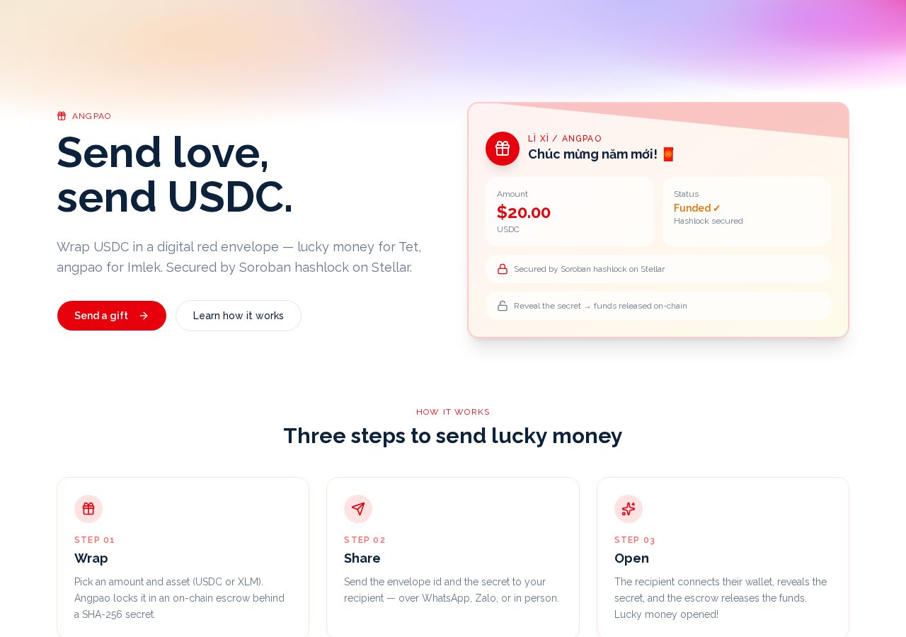
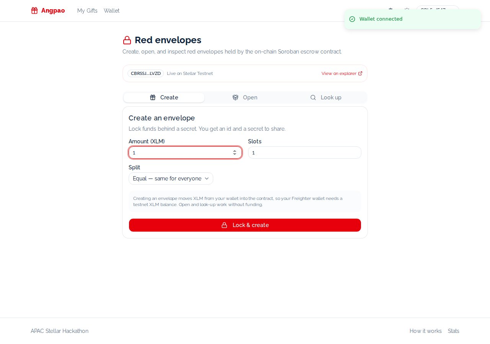
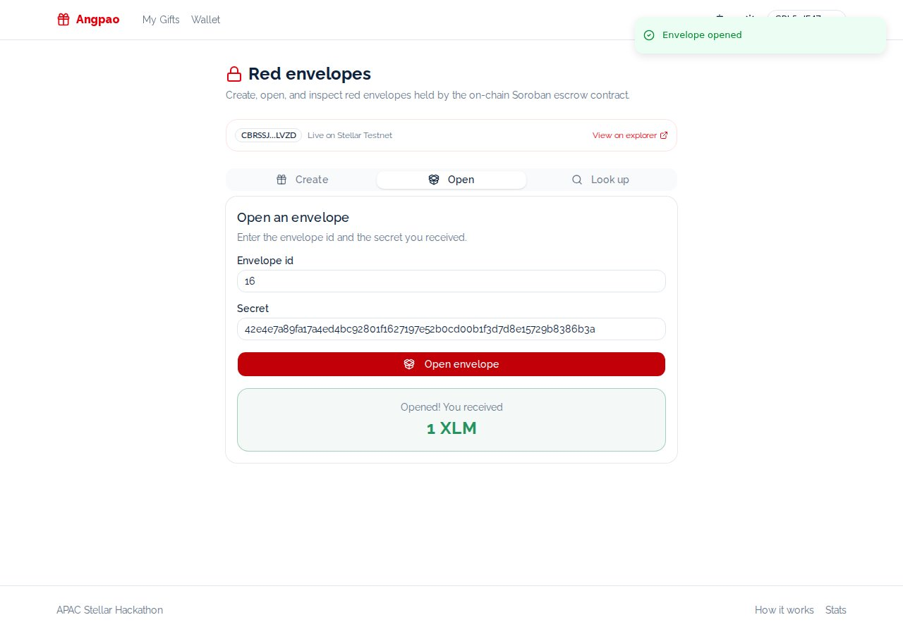
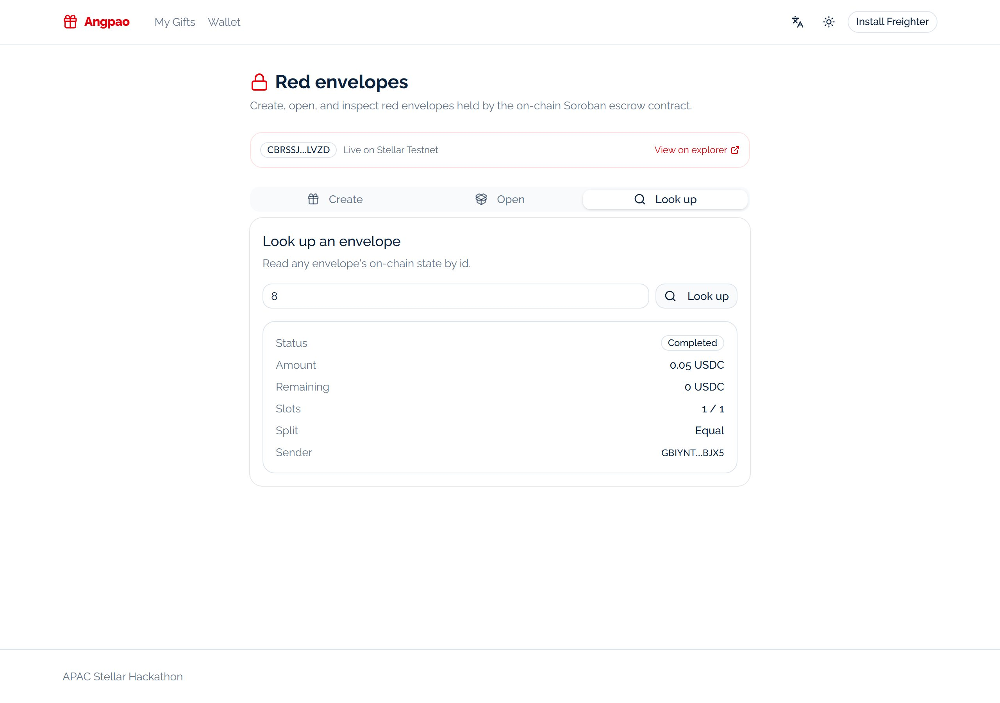
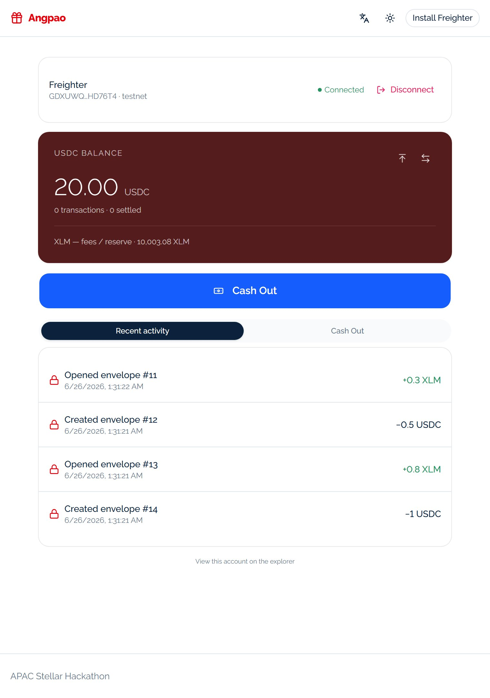
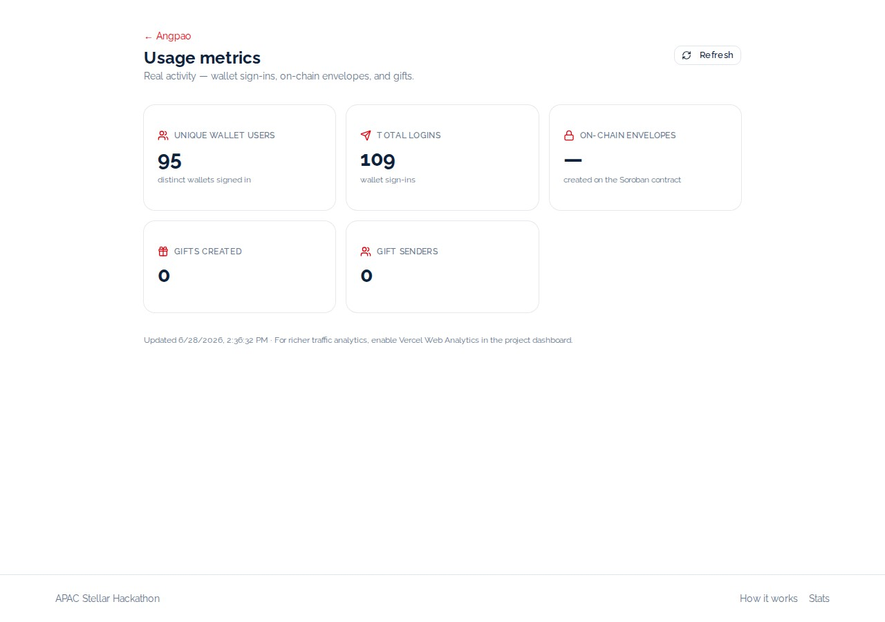
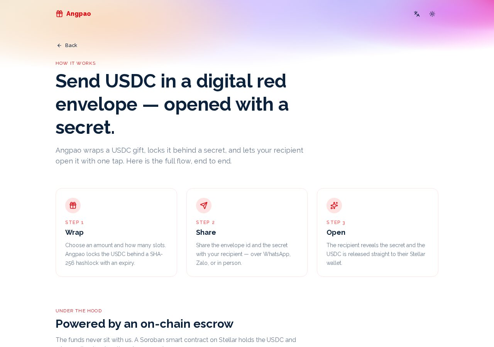

# Angpao — a developer's tour

Angpao is a digital red-envelope app (lucky money for Tết, Lebaran, Imlek) built on Stellar.
You wrap XLM or USDC into an on-chain envelope locked behind a secret; whoever knows the secret
opens it and the funds settle straight to their wallet. The custody lives in a Rust/Soroban
escrow contract — the server never holds a secret key, and never holds the money.

This README is written for the next person who has to run, read, or extend the code. It starts
with how to boot it, then walks the exact files a voucher passes through when it is created and
redeemed, then the architecture, then deploy.

**Live (Stellar Testnet):** https://angpao-three.vercel.app
**Escrow contract:** [`CBRSSJN6ZWLV53UCDGAR3ZXHO4O63NACKHYTJOFVKVR4LBBGZGA5LVZD`](https://stellar.expert/explorer/testnet/contract/CBRSSJN6ZWLV53UCDGAR3ZXHO4O63NACKHYTJOFVKVR4LBBGZGA5LVZD)



---

## Run it in 60 seconds

Every command below is a real script in [`package.json`](package.json). The app uses **pnpm**.

```bash
pnpm install
cp .env.example .env.local

# .env.local needs three things to boot the web app:
#   SESSION_SECRET          — any 32+ char string (cookie/session signing)
#   DRIZZLE_DATABASE_URL    — a Postgres URL (Neon / Supabase / local)
#   NEXT_PUBLIC_STELLAR_NETWORK=testnet
# To enable the on-chain escrow flows, also set:
#   SOROBAN_RPC_URL, SOROBAN_ESCROW_CONTRACT_ID, USDC_SAC_CONTRACT_ID
node -e "console.log(require('crypto').randomBytes(32).toString('base64'))"  # SESSION_SECRET

pnpm db:push        # apply the Drizzle schema to your Postgres
pnpm dev            # http://localhost:3000
```

Then connect Freighter (set it to **Testnet**, fund the account from
[friendbot](https://friendbot.stellar.org/)) and open the on-chain panel at `/dashboard`.

Other scripts you'll reach for:

```bash
pnpm build          # next build (production)
pnpm test           # vitest unit/component tests
pnpm test:e2e       # Playwright — incl. tests/e2e/prod-real.spec.ts against the live URL
pnpm smoke          # scripts/smoke.ts end-to-end smoke
pnpm lint           # Biome check
```

If `SOROBAN_ESCROW_CONTRACT_ID` is unset the escrow config endpoint reports `enabled: false`
and the create/open buttons stay disabled — the rest of the app still runs. That branch lives
in [`src/server/config/soroban.ts`](src/server/config/soroban.ts) (`isEscrowEnabled`).

---

## Code-walk: one voucher, end to end

The contract never receives a secret key from us. The pattern across every on-chain action is
the same three hops — **server builds an unsigned XDR → Freighter signs it in the browser →
server submits the signed XDR and polls for the result.** Follow it once and you've read the
whole app.

### Auth first (SEP-10 style)

Before any escrow call, the wallet proves ownership. The browser asks for a challenge, signs it
with Freighter, and the server mints a session cookie:

```
POST /api/auth/challenge   → app/api/auth/challenge/route.ts → authService.createChallenge()
POST /api/auth/verify      → app/api/auth/verify/route.ts    → authService.verifyAndCreateSession()
```

See [`src/server/controller/auth.controller.ts`](src/server/controller/auth.controller.ts). The
signing passphrase is pinned to the app's network (Testnet) in
[`src/ui/hooks/useFreighter.ts`](src/ui/hooks/useFreighter.ts), so a wallet left on Mainnet can't
silently break SEP-10 verification. Every escrow route is wrapped with `compose(withError,
withAuth)`, so the signed-in public key arrives as `ctx.publicKey`.

### Create a voucher



1. **UI** — [`src/ui/components/pages/onchain-client.tsx`](src/ui/components/pages/onchain-client.tsx)
   (mounted on the `/dashboard` route) calls `createEnvelope()` from the
   [`useEscrow`](src/ui/hooks/useEscrow.ts) hook with `{ amount, asset, totalSlots, split }`.

2. **Secret + build** — `POST /api/escrow/create`
   ([route](app/api/escrow/create/route.ts) → `createEnvelopeHandler` in
   [`escrow.controller.ts`](src/server/controller/escrow.controller.ts)) generates a one-time
   secret and its hashlock, then asks the service for an unsigned transaction:

   ```ts
   // src/server/service/escrow.service.ts
   const { secret, secretHash } = generateEscrowSecret();      // randomBytes(32) + sha256
   const { xdr } = await buildCreateEnvelope({ sender, amount, asset, totalSlots, split, secretHash });
   // returns { xdr, secret, secretHash, expiry, asset } — the secret is NEVER persisted server-side
   ```

   Amounts are converted to the asset's minor units (`toMinorUnits`) so floats never touch money.

3. **Soroban encode** — [`src/server/soroban/escrow.client.ts`](src/server/soroban/escrow.client.ts)
   marshals the args and invokes the contract entrypoint:

   ```ts
   // buildCreateEnvelope → create_envelope(sender, token, total_amount, total_slots,
   //                                       secret_hash, expiry, split)
   const prepared = await this.server.prepareTransaction(tx);  // simulate + attach footprint/auth
   return prepared.toXDR();
   ```

4. **Sign + submit** — the browser signs the returned XDR with Freighter (`signTransaction`,
   pinned to Testnet) and posts it to `POST /api/escrow/submit`
   ([route](app/api/escrow/submit/route.ts)), which calls `submit()` in the same client to send it
   and poll until applied. On the contract side
   ([`contracts/angpao-escrow/src/lib.rs`](contracts/angpao-escrow/src/lib.rs)),
   `create_envelope` requires the sender's auth, pulls the deposit into contract custody via the
   token SAC `transfer`, stores the hashlocked `Envelope`, emits a `create` event, and returns the
   new envelope id.

The sender walks away with **an envelope id + the secret** — two strings to hand a recipient.

### Redeem a voucher



`claimEnvelope({ envelopeId, preimage })` follows the identical build → sign → submit path:
`POST /api/escrow/claim` → `claimEnvelopeHandler` → `buildClaim()` → contract `claim(envelope_id,
recipient, preimage)`. The contract requires the **recipient's** signature (binding the payout to
them), verifies `sha256(preimage)` matches the stored hashlock, marks the slot claimed (guarding
against a double-claim), transfers the slot amount out of custody, and returns the amount paid.

If nobody opens it before `expiry`, the original funder calls `refund` (`POST /api/escrow/refund`
→ `refund(envelope_id)`) and the remaining balance comes home — funds are never stuck.

Anyone can read live on-chain state without a wallet via `GET /api/escrow/[id]` →
`get_envelope`, which is what the lookup panel renders:



### USDC opt-in

XLM is the default escrow asset; USDC is opt-in because it needs a trustline. `useEscrow` exposes
`checkUsdcTrustline()` / `setupUsdcTrustline()`, backed by
[`src/server/service/trustline.service.ts`](src/server/service/trustline.service.ts) and the
`/api/escrow/trustline` routes — one tap builds and signs a `ChangeTrust`. The available asset
list is assembled from env in [`soroban.ts`](src/server/config/soroban.ts) (`buildAssets`).

Each create / open / refund is recorded per-wallet and surfaced under Wallet → Recent activity
(`/api/escrow/activity`):



---

## Architecture

```
Browser (React 19 / Next 16 App Router)
  src/ui/components/pages/onchain-client.tsx   on-chain create / open / lookup UI
  src/ui/hooks/useEscrow.ts                    build → sign(Freighter) → submit
  src/ui/hooks/useFreighter.ts                 connect + signTransaction (Testnet-pinned)
        │  fetch + session cookie
        ▼
Next.js route handlers (app/api/**)            JSON, never locale-prefixed (proxy.ts skips /api)
  app/api/escrow/{create,claim,refund,submit,config,activity,trustline,[id]}/route.ts
        │  compose(withError, withAuth)
        ▼
Controllers → Services (src/server/**)
  escrow.controller.ts → escrow.service.ts → soroban/escrow.client.ts
        │                                        │ @stellar/stellar-sdk (build/simulate/submit)
        │  Drizzle ORM (pg)                       ▼
        ▼                              AngpaoEscrow (Rust/Soroban) — Stellar Testnet
  Postgres: sessions, gifts, escrow_activity     create_envelope · claim · refund · get_envelope
```

The contract is the trust anchor: hashlock + timelock, multi-slot equal/random split,
per-recipient double-claim guard, events, pausable admin, upgradeable. Its source, 9 passing unit
tests, deploy script and TS client live in [`contracts/`](contracts/) — read
[`contracts/README.md`](contracts/README.md) for the full design. The deployment record, including
real on-chain create + claim transactions, is in
[`contracts/DEPLOYMENT.md`](contracts/DEPLOYMENT.md).

Stack: Next.js 16.2.7 (App Router, Turbopack) · React 19 · TypeScript strict · Drizzle ORM on
Postgres · `@stellar/stellar-sdk` + `@stellar/freighter-api` · Tailwind v4 + shadcn/ui ·
`next-intl` (en / vi) · PWA. Biome for lint/format, Vitest + Playwright for tests.

Public usage metrics (real wallets, gifts, on-chain envelope count) are served unauthenticated by
`GET /api/stats` ([`usage.service.ts`](src/server/service/usage.service.ts)) and rendered at
[`/stats`](https://angpao-three.vercel.app/stats):



| Metric | Value | Notes |
|---|---|---|
| Unique wallet users | 95 | distinct wallets signed in |
| Total logins | 109 | wallet sign-ins |
| On-chain envelopes | — | created on the Soroban contract |
| Gifts created | 0 | envelopes |
| Gift senders | 0 | distinct senders |

---

## Deploy

The web app deploys to **Vercel** (it is already live at the URL above on Stellar Testnet). Set
the same env vars from `.env.example` in the Vercel project — at minimum `SESSION_SECRET`,
`DRIZZLE_DATABASE_URL`, `NEXT_PUBLIC_STELLAR_NETWORK`, and the `SOROBAN_*` / `USDC_SAC_CONTRACT_ID`
values — then `pnpm build` runs on the platform.

The contract is built and deployed from [`contracts/`](contracts/):

```bash
cd contracts
cargo test                       # 9/9 pass
stellar contract build           # wasm32v1-none
NETWORK=testnet ./scripts/deploy.sh
```

**Mainnet readiness (not live).** Everything here runs on Testnet. The contract is upgradeable and
the deploy script takes a `NETWORK=mainnet` path; the exact steps and the
`SOROBAN_ESCROW_CONTRACT_ID` repoint are documented in
[`contracts/DEPLOYMENT.md`](contracts/DEPLOYMENT.md) under "Redeploy / upgrade notes". No mainnet
deployment exists yet.



---

<sub>Built on Stellar Testnet · non-custodial red envelopes, secured by a Soroban escrow.</sub>
