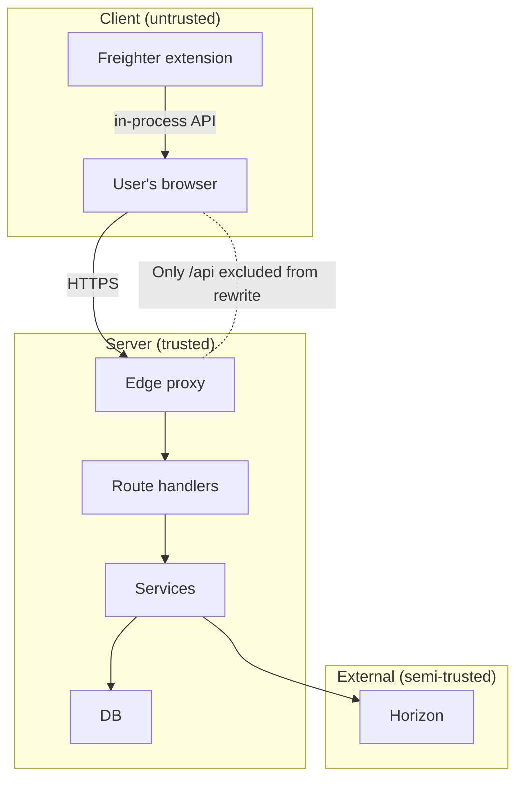
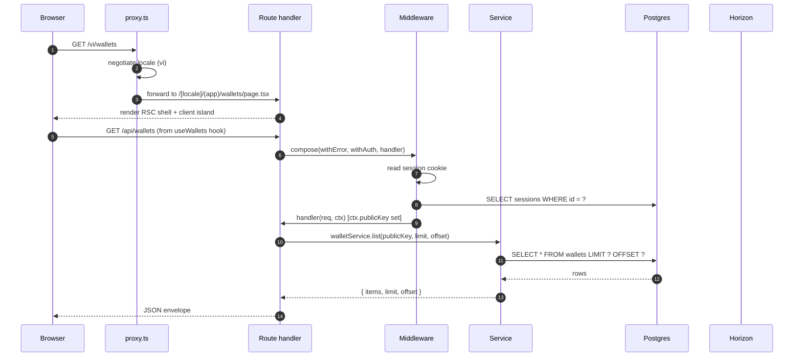
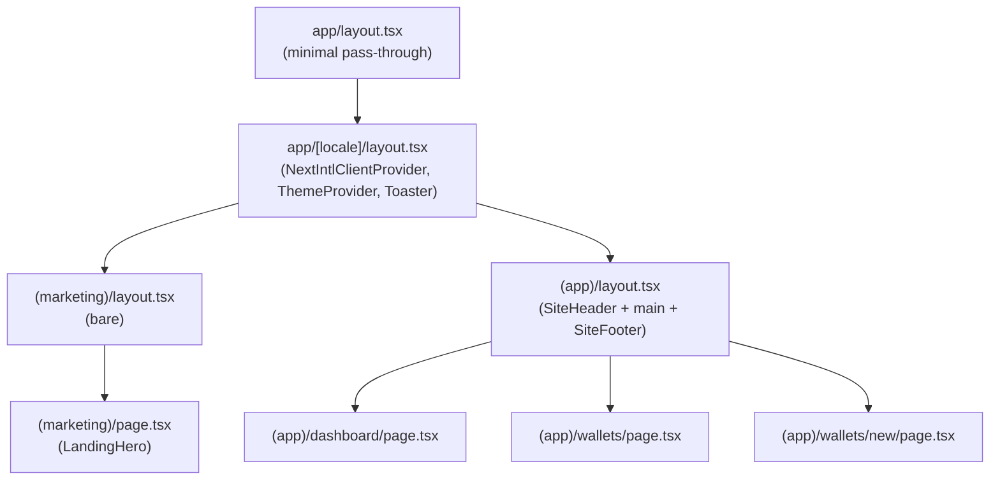
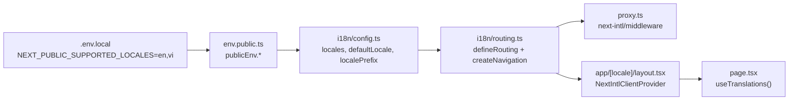
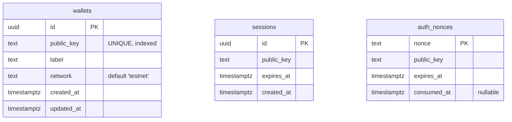

# Stellar Hackathon — System Architecture

> Audience: architects, reviewers, and senior engineers evaluating or extending this codebase.
> Scope: the implementation as of the last commit on `main`. The codebase is an early-stage Next.js 16
> application that demonstrates Stellar wallet authentication, a CRUD "wallets" feature, and bilingual
> UI scaffolding for a hackathon submission. Many pieces are intentionally minimal and are flagged
> as such throughout this document.

---

## Table of contents

- [0. Executive summary](#0-executive-summary)
- [1. System context](#1-system-context)
- [2. High-level architecture](#2-high-level-architecture)
- [3. Tech stack and version pin](#3-tech-stack-and-version-pin)
- [4. Routing and request lifecycle](#4-routing-and-request-lifecycle)
- [5. Internationalization](#5-internationalization)
- [6. Authentication and session model](#6-authentication-and-session-model)
- [7. Data layer](#7-data-layer)
- [8. Blockchain integration](#8-blockchain-integration)
- [9. UI architecture](#9-ui-architecture)
- [10. Environment and configuration](#10-environment-and-configuration)
- [11. Security model](#11-security-model)
- [12. Observability and operations](#12-observability-and-operations)
- [13. Quality gates](#13-quality-gates)
- [14. Extension points](#14-extension-points)
- [15. Known constraints and follow-ups](#15-known-constraints-and-follow-ups)
- [16. Progressive Web App](#16-progressive-web-app)
- [Appendix A — File index](#appendix-a--file-index)
- [Appendix B — Environment variable reference](#appendix-b--environment-variable-reference)
- [Appendix C — Glossary](#appendix-c--glossary)

---

## 0. Executive summary

### What this is

A **Next.js 16 (App Router, Turbopack) + React 19** application that:

- Lets a visitor authenticate by signing a server-issued nonce with a [Freighter] Stellar wallet.
- Persists the resulting server-side session in a Postgres database, identified by an opaque
  cookie.
- Lets the authenticated user manage a list of "watched" Stellar wallets (label + public key) in a
  bilingual (English / Vietnamese) UI.

### Top-level shape

| Concern | Choice | Rationale |
|---|---|---|
| Framework | Next.js 16.2.7 (App Router, Turbopack) | Server components by default, route handlers, file-based routing; Turbopack is the default dev experience. |
| Language | TypeScript (strict) | Same as the rest of the stack. |
| i18n | `next-intl` 4.13.0 | Mature, RSC-friendly, plugin-wired. |
| Data | Drizzle ORM 0.45 + `pg` 8.21 | Schema-first, type-safe, no codegen step beyond `drizzle-kit`. |
| UI | shadcn/ui (radix-nova style) + Tailwind v4 | Copy-pasteable primitives, no runtime component lib lock-in. |
| Auth | Nonce challenge / signature verify, DB sessions | Self-issued, no third-party IdP, no JWT. |
| Lint / format | Biome 2.4 (primary), ESLint 9 (Next.js core-web-vitals only) | Biome replaces Prettier+ESLint for most concerns. |
| Tests | Vitest 4 + Testing Library (jsdom) | Same aliases as the Next.js app via `vitest.config.ts`. |

### The five most consequential design decisions

1. **Public env / server env split.** `env.public.ts` is the only env module reachable from
   client code. Server-only secrets live in `env.ts`. This is what makes the bilingual landing
   page render in the browser without dragging `SESSION_SECRET` validation into the bundle
   (see [§10](#10-environment-and-configuration)).
2. **Wallet auth via challenge/response, not SIWE / JWT.** Sessions are opaque UUIDs stored in
   Postgres. The signing surface is a Stellar `DecoratedSignature` XDR, not an Ethereum-style
   personal_sign blob (see [§6](#6-authentication-and-session-model)).
3. **Functional middleware composition.** Route handlers are wrapped via
   `compose(withError, withAuth, handler)` in `src/server/middleware/compose.ts`, not a class
   hierarchy or framework-specific decorators. This makes each step individually testable
   (see [§4.3](#43-api-route-middleware-composition)).
4. **Pages are client components by default; layout is server.** A pragmatic inversion of the
   RSC-first doctrine, driven by the fact that almost every page is interactive and fetches via
   hooks. Layout chrome stays on the server (see [§9.1](#91-server-vs-client-component-boundary)).
5. **`middleware.ts` is now `proxy.ts`.** Renamed in line with the Next.js 16 convention to avoid
   Turbopack treating it as a built-in middleware file (see [§4.1](#41-the-edge-proxy)).

### Status snapshot

- Authentication, session, wallets CRUD, i18n, and the marketing landing page are working.
- No CI is configured. No Drizzle migrations have been generated yet (schema is defined but
  `drizzle-kit generate` has not been run). Friendbot funding is not implemented; the wallet
  service only stores keys.
- See [§15](#15-known-constraints-and-follow-ups) for the full list of gaps.

[freighter]: https://www.freighter.app/

---

## 1. System context

### 1.1 Container diagram (C4 level 2)

```mermaid
flowchart LR
  user[End user<br/>(browser + Freighter extension)]

  subgraph "Next.js 16 application"
    direction TB
    edge["Edge proxy<br/>(proxy.ts → next-intl/middleware)"]
    rsc["App Router pages<br/>(RSC + client components)"]
    api["Route handlers<br/>(/api/auth, /api/wallets, /api/health)"]
    svc["Server services<br/>(auth, wallet, stellar)"]
    db["Drizzle ORM<br/>+ pg Pool"]
  end

  pg[(Postgres)]
  horizon[Stellar Horizon<br/>horizon-testnet.stellar.org]
  freighter[Freighter extension<br/>window.freighterApi]

  user -- HTTPS --> edge
  user -- wallet signing --> freighter
  freighter -- signed XDR --> rsc
  edge --> rsc
  edge --> api
  rsc --> svc
  api --> svc
  svc --> db
  db --> pg
  svc -- HTTPS --> horizon
```

### 1.2 External dependencies

| Dependency | Purpose | Failure mode in the app |
|---|---|---|
| **Postgres** (via `DRIZZLE_DATABASE_URL`) | Persistent storage for `wallets`, `sessions`, `auth_nonces`. | API routes 500 immediately. The app does not currently expose a "DB down" status. |
| **Stellar Horizon** (`horizon-testnet.stellar.org` by default) | Read-only check `accountExists(publicKey)` in `src/server/service/stellar.service.ts`. | The wallets CRUD does **not** call this today; the only consumer is the service export, which is not wired into any controller yet. |
| **Freighter browser extension** | Source of truth for the user's Stellar keypair. The app never holds a secret. | The `WalletButton` and `useFreighter` hook detect the `window.freighterApi` global; if absent, the connect button disables and shows a hint to install the extension. |
| **next-intl middleware** | Locale negotiation, default-locale redirect, locale-prefix rewriting at the edge. | Without it, locale-segmented routes (`/vi/...`) would 404. |

### 1.3 Trust boundaries



The client cannot directly touch the database, Horizon, or any other server-side service. All
sensitive state (session, wallet list) is reached through `/api/*` route handlers that
explicitly compose authentication and error middleware.

---

## 2. High-level architecture

### 2.1 Module map

The repository is split into four top-level concerns. The boundary is enforced by convention
(no `'use server'` / `'use client'` mix-ups in practice) and by the `@/` path alias setup in
both `tsconfig.json` and `vitest.config.ts`.

```
stellar-hackathon/
├── app/                      # Next.js App Router (file = route)
│   ├── [locale]/             # All user-facing pages live under a locale segment
│   │   ├── (marketing)/      # Public landing (no shell)
│   │   └── (app)/            # Authenticated-feeling pages (header + footer)
│   └── api/                  # API route handlers (no locale prefix)
├── src/
│   ├── i18n/                 # next-intl config: config.ts, routing.ts, request.ts
│   ├── server/               # All server-only code
│   │   ├── config/           # env validation, Stellar network config
│   │   ├── controller/       # Thin request handlers (parse → service → respond)
│   │   ├── service/          # Business logic (auth, wallet, stellar)
│   │   ├── db/               # Drizzle schema + client
│   │   ├── lib/              # http helpers, cookies, logger
│   │   └── middleware/       # withError, withAuth, withRateLimit, compose
│   └── ui/                   # All client-side code
│       ├── components/
│       │   ├── ui/           # shadcn/ui primitives (25)
│       │   ├── layout/       # SiteHeader, SiteFooter, WalletButton
│       │   ├── pages/        # Page-level composites (LandingHero, WalletForm, WalletsTable)
│       │   └── shared/       # AddressBadge, GradientBg, LanguageSwitcher, etc.
│       ├── hooks/            # useFreighter, useWallets, useSession, useToast
│       └── lib/              # api.ts (axios wrapper), stellar.ts, utils.ts
├── messages/                 # next-intl message catalogs (en.json, vi.json)
├── tests/                    # Vitest suites (server/, ui/)
└── docs/                     # This file and friends
```

### 2.2 Why a `src/` directory at all

The Next.js App Router co-locates routes in `app/`. Keeping all non-route code under `src/`
gives:

- A clean import path: `@/server/...`, `@/ui/...`, `@/i18n/...`.
- A physical separation that the bundler can use to tree-shake the `src/ui` tree out of server
  bundles (and vice versa) without anyone having to remember to add a directive.
- A single place for tests to import from (`@/server/...` resolves identically in Vitest).

### 2.3 The request lifecycle at a glance



This sequence is identical for every authenticated read. The only difference for write paths
(wallets POST/PATCH/DELETE) is that the service mutates the `wallets` table; there is currently
no Horizon call on the write path (see [§8](#8-blockchain-integration)).

---

## 3. Tech stack and version pin

All versions are pinned in `package.json` (no `^` or `~`). The relevant subset:

| Layer | Package | Version | Notes |
|---|---|---|---|
| Framework | `next` | 16.2.7 | App Router, Turbopack default. |
| Runtime | `react`, `react-dom` | 19.2.4 | New ref, `use()`, server actions. |
| i18n | `next-intl` | 4.13.0 | Wired as a Next config plugin. |
| ORM | `drizzle-orm` | 0.45.2 | Schema-first. |
| DB driver | `pg` | 8.21.0 | Vanilla node-postgres; no Neon serverless adapter. |
| Migrations | `drizzle-kit` | 0.31.10 | Configured in `drizzle.config.ts`, not yet executed. |
| Wallet SDK | `@stellar/stellar-sdk` | 15.1.0 | `StrKey`, `Keypair`, `Horizon.Server`, `xdr`. |
| Wallet bridge | `@stellar/freighter-api` | 6.0.1 | Detect, request access, signAuthEntry. |
| Styling | `tailwindcss` | 4 | CSS-first config via `@theme` in `app/globals.css`. |
| Styling | `@tailwindcss/postcss` | 4 | PostCSS plugin. |
| UI primitives | `radix-ui` | 1.4.3 | Via shadcn `radix-nova` style. |
| UI generator | `shadcn` | 4.10.0 | `components.json` declares RSC mode. |
| Forms | `react-hook-form` | 7.77.0 | |
| Forms | `@hookform/resolvers` | 5.4.0 | zodResolver. |
| Validation | `zod` | 4.4.3 | Used in env, forms, controllers. |
| HTTP | `axios` | 1.17.0 | Typed envelope wrapper in `src/ui/lib/api.ts`. |
| Icons | `lucide-react` | 1.17.0 | |
| Toasts | `sonner` | 2.0.7 | `<Toaster />` mounted in root layout. |
| Theme | `next-themes` | 0.4.6 | Class-based, drives `.dark` on `<html>`. |
| Lint | `@biomejs/biome` | 2.4.16 | Primary linter and formatter. |
| Lint | `eslint` | 9 | `eslint-config-next` 16.2.7, core-web-vitals only. |
| Test | `vitest` | 4.1.8 | jsdom env, `tests/setup.ts` for jest-dom matchers. |
| Test | `@testing-library/react` | 16.3.2 | |
| Test | `@testing-library/jest-dom` | 6.9.1 | |
| Test | `jsdom` | 29.1.1 | |

Since 2026-06-14 the body font is Noto Sans (with Noto Sans Mono for code), loaded via
`next/font/google` in `app/[locale]/layout.tsx`. The Vietnamese subset is included so
that the `vi` locale's diacritics render without falling back to system fonts. The
previous Inter / JetBrains Mono swap-out was a one-line change — `--font-sans` and
`--font-mono` CSS variables were unchanged; only the font sources behind them moved.

### 3.1 What was deliberately not chosen

- **No NextAuth / Auth.js.** The Stellar wallet is the identity provider. A third-party IdP would
  add a layer that buys us nothing here.
- **No Prisma.** Drizzle's schema-first approach matches the rest of the codebase (Zod everywhere)
  and avoids a separate generator step.
- **No `react-query` / SWR / Zustand.** Every fetch is a local `useState` + `useEffect` inside a
  single hook. The data needs are small and the lifetime of each piece of state is the lifetime
  of one page.
- **No `framer-motion`.** The few transitions are Tailwind utilities; `tw-animate-css` provides
  the `animate-in` family.

---

## 4. Routing and request lifecycle

### 4.1 The edge proxy

`proxy.ts` (formerly `middleware.ts`, renamed in the Next.js 16 convention to avoid Turbopack
collision) is the entire request entry point for non-API traffic:

```ts
// proxy.ts:1-8
import createMiddleware from 'next-intl/middleware';
import { routing } from '@/i18n/routing';

export default createMiddleware(routing);

export const config = {
  matcher: ['/((?!api|_next|.*\\..*).*)'],
};
```

What this does:

- Rewrites `/` → `/{defaultLocale}` (or `/` if `localePrefix === 'as-needed'`).
- Rewrites `/vi/wallets` → `app/[locale]/(app)/wallets/page.tsx` with `params.locale = 'vi'`.
- Honors the `NEXT_PUBLIC_DEFAULT_LOCALE` cookie and the `Accept-Language` header.
- The matcher excludes `/api/*`, `/_next/*`, and any path with a file extension. **API routes do
  not pass through this proxy** — they speak JSON, not locale-prefixed paths.

### 4.2 App Router layout



Each `page.tsx` in `(app)` is a **client component** that owns its own data fetching. The
`SiteHeader` is a server component (it calls `getTranslations`); the `WalletButton` nested in
it is a client island (it uses `useSession`, `useFreighter`).

#### 4.2.1 Client-side auth gate

Since 2026-06-14, every page under `app/[locale]/(app)/` is wrapped by `<RequireAuth>` in
`(app)/layout.tsx`. The component reads `useRequireSession()` (a thin status mapper over
`useSession()`) and renders one of three states:

- a `<Skeleton>` block while the session is loading,
- a "Connect your wallet" card with a CTA to `/connect` when unauthenticated,
- the page children when authenticated.

`<RequireAuth>` is path-agnostic. The `/connect` page itself is also under `(app)/` but
remains reachable: when the user clicks the gate's CTA, `<Link href="/connect">` lands
them on the sign-in flow. No allowlist is needed.

Server-side auth is unchanged — `withAuth` middleware still protects every API route that
needs it. The client gate is a UX layer; data is still guarded by the server.

The gate preserves the layout tree's RSC boundaries: `(app)/layout.tsx` is a server
component; `<RequireAuth>` is a client island inserted via the standard "server renders
client" pattern, the same way `account-chip.tsx` is used inside the server-rendered
`SiteHeader`.

#### 4.2.2 Page transitions

The three public-facing shells — `(app)`, `(marketing)`, `checkout` — all wrap their
children in `<PageTransition>`, a framer-motion `AnimatePresence` keyed by
`usePathname()` (the next-intl wrapper from `@/i18n/routing`, which strips the locale
prefix). Transitions are 200ms ease-out, 8px y-offset.

Order matters: in `(app)/layout.tsx`, `<PageTransition>` wraps `<RequireAuth>`. If the
gate were outside the transition, signed-out users would see a brief dashboard flash
before the gate replaced it with the CTA. Keeping the gate inside means the gate's
skeleton, CTA, and children all fade in/out as a unit on every route change.

`framer-motion@^12` was added to `dependencies` for this. It is the project's only
animation library; the existing `tw-animate-css` and `tailwindcss-animate` packages
provide CSS-only micro-animations (hover, focus, accordion, dialog) and are unaffected.

### 4.3 API route middleware composition

Every route handler is composed with `compose(...middlewares)(handler)` from
`src/server/middleware/compose.ts`:

```ts
// src/server/middleware/compose.ts (the whole file, conceptually)
export const compose = (...middlewares: Middleware[]) =>
  (handler: RouteHandler): RouteHandler =>
    middlewares.reduceRight((acc, mw) => mw(acc), handler);
```

`reduceRight` means the **leftmost** middleware in the call is the **outermost** wrapper, so
`compose(withError, withAuth, handler)` runs `withError → withAuth → handler` on the way in,
and `handler → withAuth → withError` on the way out. This is the standard koa-style onion.

The current middleware inventory:

| Middleware | Responsibility | Source |
|---|---|---|
| `withError` | Catches `AppError` thrown by the handler, maps it to a JSON envelope (`{ error: { code, message, status } }`). | `src/server/middleware/withError.ts` |
| `withAuth` | Reads the session cookie, looks it up, expires-on-check, injects `ctx.publicKey`. Throws `UNAUTHORIZED` on failure. | `src/server/middleware/withAuth.ts:1-22` |
| `withRateLimit` | Per-IP token bucket (in-memory). | `src/server/middleware/withRateLimit.ts` |

Per-route composition (current state):

| Route | Composed as |
|---|---|
| `POST /api/auth/challenge` | `compose(withError, withRateLimit)` |
| `POST /api/auth/verify` | `compose(withError, withRateLimit)` |
| `POST /api/auth/logout` | `compose(withError, withAuth)` |
| `GET  /api/auth/me` | `compose(withError, withAuth)` |
| `*    /api/wallets` | `compose(withError, withAuth)` |
| `*    /api/wallets/[id]` | `compose(withError, withAuth)` |
| `GET  /api/health` | `compose(withError)` |

### 4.4 Response envelope

All `/api/*` responses share a typed envelope declared in `src/server/lib/http.ts`:

```ts
type Ok<T>    = { data: T };
type Created<T> = { data: T };
type Fail     = { error: { code: string; message: string; status: number } };
```

The axios client on the frontend (`src/ui/lib/api.ts`) unwraps `data` and throws on `error`,
so a 4xx from the server surfaces as a thrown `Error` in the hook that called it.

---

## 5. Internationalization

### 5.1 Configuration flow



Each arrow is a one-line import. There is no runtime locale list hardcoded anywhere except in
the `messages/` directory, which is the only place where translations actually live.

### 5.2 Locales, prefix, and fallbacks

- `NEXT_PUBLIC_SUPPORTED_LOCALES` is a comma-separated list. `locales` in `i18n/config.ts` is
  derived by `.split(',')`. The `as readonly string[]` cast trusts the env contract — there is
  no per-locale validation that the file actually exists in `messages/`. A typo in the env
  var will surface as a missing key at request time.
- `NEXT_PUBLIC_LOCALE_PREFIX` accepts `always | as-needed | never`. The default `as-needed`
  means the default locale has no URL prefix. This is the right default for SEO on an
  English-primary site, but switch to `always` if Vietnamese is intended to be first-class.
- The fallback in `i18n/request.ts:8` is `routing.defaultLocale` whenever `hasLocale()` rejects
  the requested value. This catches both unknown query strings and unsupported Accept-Language.

### 5.3 Message catalog

`messages/en.json` and `messages/vi.json` are flat-ish (2 levels max), keyed by component.
Schema:

```jsonc
{
  "Metadata":  { "title": "...", "description": "..." },
  "Hero":      { "eyebrow": "...", "title": "...", "subtitle": "...", "ctaPrimary": "...", "ctaSecondary": "..." },
  "Nav":       { "home": "...", "wallets": "...", "dashboard": "...", "connectWallet": "...", "disconnect": "...", "language": "..." },
  "Wallets":   { /* form, table, errors */ },
  "Auth":      { "challengeError": "...", "verifyError": "...", "signInPrompt": "..." },
  "Common":    { "loading": "...", "error": "...", "retry": "..." }
}
```

There is no key-level schema enforcement (e.g. via `@formatjs/intl` or a custom typegen step).
Both catalogs are hand-maintained; missing keys surface at request time as
`Translation missing: <Namespace>.<key>`.

### 5.4 Server vs client translations

- **Server components** (e.g. `SiteHeader`) call `getTranslations` from `next-intl/server`
  inside the async function. This works in App Router server components.
- **Client components** call `useTranslations('Hero')` from `next-intl`. The
  `NextIntlClientProvider` in `app/[locale]/layout.tsx` makes the messages available on the
  client.
- The `LanguageSwitcher` is a client component that uses `useRouter` and `usePathname` from
  `createNavigation(routing)` to switch locales while preserving the current path.

---

## 6. Authentication and session model

### 6.1 Threat model (in scope)

- An attacker can submit arbitrary JSON to `/api/auth/*`.
- An attacker can read the session cookie but cannot forge one (it is a 128-bit random ID).
- An attacker can install Freighter and present a keypair they control; this is the attack we
  *want* them to be able to do, because proving key ownership is the point of the auth.
- An attacker can replay an old, unconsumed nonce. The server rejects reused nonces by
  marking them `consumedAt` on first use (see below).

### 6.2 What is *not* in scope (yet)

- No CSRF protection on POST routes beyond `SameSite=Lax` cookies. Adding a CSRF token
  middleware is a follow-up.
- No rate limit on `/api/wallets/*` (only on `/api/auth/*`). See
  [§15](#15-known-constraints-and-follow-ups).
- No session invalidation by public key (logging out one device does not log out others).

### 6.3 The challenge/response flow

```mermaid
sequenceDiagram
  autonumber
  participant U as User (browser)
  participant F as Freighter
  participant S as /api/auth/challenge
  participant V as /api/auth/verify
  participant DB as Postgres

  U->>S: POST { publicKey }
  S->>S: validate ed25519 format (StrKey)
  S->>DB: INSERT auth_nonces (nonce, publicKey, expiresAt=now+5m)
  S-->>U: { nonce, expiresAt }
  U->>F: signAuthEntry({ hash: SHA-256(nonce) })
  F-->>U: signedXdr (base64)
  U->>V: POST { publicKey, signedNonce }
  V->>V: parse DecoratedSignature from XDR
  V->>DB: SELECT nonces WHERE publicKey=? AND consumedAt IS NULL AND expiresAt > now()
  V->>V: for each candidate: kp.verify(SHA-256(nonce), sigBytes)
  V->>DB: UPDATE auth_nonces SET consumedAt=now() WHERE nonce=?
  V->>DB: INSERT sessions (id, publicKey, expiresAt=now+7d)
  V-->>U: Set-Cookie: stellar_session=<uuid>; HttpOnly; SameSite=Lax
```

### 6.4 Key design choices in `auth.service.ts`

- **Nonce is 24 random bytes, base64url-encoded.** Stored as the primary key of `auth_nonces`
  (`text` column). No `id` surrogate; the nonce *is* the identifier.
- **`expiresAt` defaults to `now + NONCE_TTL_SECONDS` (default 300s).** The server filters by
  `expiresAt > now()` at verify time, so expired rows are not relied on to be reaped (no cron
  job is in place yet — they will accumulate; see [§15](#15-known-constraints-and-follow-ups)).
- **Signature verification iterates all live nonces for that public key.** This is a
  defense-in-depth choice: even if a particular nonce is somehow ambiguous, the first match
  wins and gets marked consumed. It is not a bottleneck because the set is tiny (one user,
  one in-flight flow).
- **Sessions are server-side.** The cookie holds a UUID; the server hits Postgres on every
  request to look it up. There is no JWT, no signed token, no client-side claim.
- **`consumedAt` is the replay defense.** A nonce can be verified at most once, because
  verification UPDATEs `consumedAt`. The lookup query excludes rows with non-null
  `consumedAt`.

### 6.5 Cookie attributes

Set in `src/server/lib/cookies.ts`:

| Attribute | Value | Reason |
|---|---|---|
| `Name` | `env.SESSION_COOKIE_NAME` (default `stellar_session`) | Configurable for multi-app hosts. |
| `Path` | `/` | All routes. |
| `HttpOnly` | (always) | JS cannot read the session ID. |
| `SameSite` | `Lax` | Default. CSRF protection is the responsibility of the `Lax` value plus the fact that the cookie is only sent on first-party requests. |
| `Secure` | When `NODE_ENV === 'production'` | Dev runs on `http://localhost`. |
| `Max-Age` | `env.SESSION_TTL_SECONDS` (default 604800 = 7d) | Refreshed only on sign-in; not a sliding session. |

### 6.6 Logout

`POST /api/auth/logout` calls `authService.destroySession(sessionId)` which deletes the
`sessions` row, and then clears the cookie by appending a `Max-Age=0` variant. The client hook
`useSession().logout()` then re-fetches `/api/auth/me` to confirm the cookie is gone.

### 6.7 Why not SIWE-style "Sign this message"?

`signAuthEntry` is the Stellar equivalent of EIP-4361. It produces a `DecoratedSignature` XDR
that the server can parse natively with `@stellar/stellar-sdk`. There is no need to construct a
CAIP-122-style human-readable message, hash it, and verify it on the server — Stellar's
`Keypair.verify(SHA-256(nonce), sig)` does exactly the equivalent and is already used in
`auth.service.ts`.

---

## 7. Data layer

### 7.1 Schema overview

Three tables, defined in `src/server/db/schema/`:



There is **no foreign key** between `wallets` and `sessions` — the only link is logical (a
`wallets` row is created by a session whose `public_key` matches). The decision is deliberate:
it keeps the auth subsystem decoupled from the wallets domain and means dropping the `wallets`
table never touches auth.

### 7.2 Connection management

`src/server/db/client.ts` uses the standard "global pool" pattern to survive HMR in dev:

```ts
// src/server/db/client.ts:5-10
const globalForDb = globalThis as unknown as { pgPool: Pool | undefined };
const pool = globalForDb.pgPool ?? new Pool({
  connectionString: env.DRIZZLE_DATABASE_URL,
  max: 10,
});
if (env.NODE_ENV !== 'production') globalForDb.pgPool = pool;

export const db = drizzle(pool, { schema });
```

Trade-offs:

- ✅ Connection reuse across HMR reloads in dev.
- ✅ Serverless-friendly enough for `next start` (one process, long-lived pool).
- ⚠️ In a serverless deploy (Vercel functions, Cloud Run instances spinning up/down), the
  pool-per-instance pattern can lead to connection storms. For that case, either pin the
  instance to one (e.g. via min-instances) or switch to a serverless adapter (Neon, PlanetScale)
  with HTTP transport. **Not currently a problem in local dev.**

### 7.3 Migrations

`drizzle.config.ts` declares `out: './drizzle'` and `dialect: 'postgresql'`. The committed
migrations live at `./drizzle/0000_young_odin.sql` and `./drizzle/0001_giant_goliath.sql`,
tracked in `./drizzle/meta/_journal.json`. Concretely:

```bash
npm run db:migrate     # applies any unapplied migrations from ./drizzle/
npm run db:generate    # writes a new SQL file after a schema change
```

For first-time setup against an empty database, use `npm run db:push:ci`, which calls
`drizzle-kit migrate` under the hood. This is the CI-safe equivalent of `npm run db:push`,
which requires a TTY for the interactive confirmation prompt and will fail in any
non-interactive shell (CI, scripts, piped commands).

### 7.4 Why Drizzle over Prisma

- **Same schema language as the validation layer (Zod).** Both are TypeScript-native, both
  export types you can compose.
- **No separate generator run before `tsc`.** `drizzle-kit` is dev-time only.
- **Smaller client.** Drizzle ships ~10kb of runtime vs Prisma's query engine.

### 7.5 What the wallets service *does not* do

- It does **not** call `stellarService.accountExists` on insert. A user can save a public key
  that has no on-chain account. The `stellarService` is wired in but unused by any controller
  today.
- It does **not** call Friendbot to fund new accounts. There is no "create new wallet" flow
  on the server; the only "create" path is the user pasting a public key + label and the row
  being persisted.

---

## 8. Blockchain integration

### 8.1 What is in scope

- **Reading** the existence of an account on the configured Stellar network.
- **Parsing and verifying** `DecoratedSignature` XDRs in the auth flow.
- **Validating public key format** at every entry point (form, controller, service).

### 8.2 What is not in scope

- Submitting transactions. There is no `TransactionBuilder` call site in the codebase today.
- Friendbot funding. The "wallets" feature is read-mostly; the user brings their own keys.
- Account viewing (subentry count, balances, signers). When this is added, it should go
  through the same `stellarService` and be rate-limited.

### 8.3 Network configuration

`src/server/config/stellar.ts` is a network map:

| `STELLAR_NETWORK` | Passphrase | Horizon URL |
|---|---|---|
| `testnet` (default) | `Networks.TESTNET` | `https://horizon-testnet.stellar.org` |
| `public` | `Networks.PUBLIC` | `https://horizon.stellar.org` |
| `futurenet` | `Networks.FUTURENET` | `https://horizon-futurenet.stellar.org` |

`env.STELLAR_HORIZON_URL` and `env.STELLAR_NETWORK_PASSPHRASE` override the defaults, which
is the right escape hatch for local Horizon instances or custom networks.

### 8.4 Public key validation

There are three call sites for ed25519 public key validation, all using `StrKey`:

| Site | Purpose |
|---|---|
| `src/ui/lib/stellar.ts:3-5` (`isValidPublicKey`) | Client form validation in `WalletForm`. |
| `src/server/service/auth.service.ts` (`createChallenge`) | First line of defense on `POST /api/auth/challenge`. |
| `src/server/service/wallet.service.ts` (`create`) | First line of defense on `POST /api/wallets`. |

**Server-side validation is the authoritative one.** Client-side validation exists only to
give the user instant feedback and to avoid a round-trip for typos.

### 8.5 `accountExists` and its current usage

`src/server/service/stellar.service.ts` is a 14-line module wrapping `Horizon.Server.loadAccount`
in a 404-aware try/catch. The export is `stellarService.accountExists(publicKey): Promise<boolean>`.
It is currently **not called from any route handler**. It is the right primitive to drop into
the wallets POST flow when the product wants "this wallet is funded on the network" to be a
hard requirement.

---

## 9. UI architecture

### 9.1 Server vs client component boundary

| Layer | Default | Why |
|---|---|---|
| **Layout chrome** (`SiteHeader`, `SiteFooter`, `app/[locale]/layout.tsx`) | Server | Translates with `getTranslations`, no state. |
| **Static shared** (`GradientBg`, `BrandMark`, `EmptyState`) | Server | Pure markup, no interactivity. |
| **Interactive shared** (`LanguageSwitcher`, `ThemeToggle`, `AddressBadge`, `WalletButton`) | Client | All touch browser APIs (`window.freighterApi`, `localStorage`, `document.documentElement.classList`). |
| **Page-level composites** (`LandingHero`, `WalletForm`, `WalletsTable`) | Client | All take input, all call hooks, all do optimistic UI. |
| **Pages** (`(app)/dashboard/page.tsx`, `(app)/wallets/page.tsx`, `(app)/wallets/new/page.tsx`, `(marketing)/page.tsx`) | Client | Each page is a thin wrapper around one composite. |

This is an inversion of the "server-first" RSC doctrine. The rationale:

- Almost every page is data-driven, and the data lives behind a session that only the browser
  knows about (via cookie).
- The hook-based fetch path is so thin (3–4 lines per hook) that moving it to RSC would
  require parallel server-only fetch helpers and a client/server bridge.
- Layout chrome stays on the server so the first paint is bilingual and fully styled.

### 9.2 shadcn/ui setup

`components.json` declares:

- Style: `radix-nova`
- RSC mode: enabled
- Tailwind config: `app/globals.css` (CSS-first, Tailwind v4)
- Path aliases: `components/ui` → `src/ui/components/ui`, `lib` → `src/ui/lib`, etc.

The full set of primitives (25) installed at `src/ui/components/ui/`: `avatar`, `badge`,
`button`, `card`, `command`, `dialog`, `dropdown-menu`, `form`, `input`, `input-group`, `label`,
`progress`, `scroll-area`, `select`, `separator`, `sheet`, `skeleton`, `slider`, `sonner`,
`switch`, `table`, `tabs`, `textarea`, `tooltip`.

`sonner.tsx` is the shadcn-provided Toaster wrapper; the `<Toaster />` is mounted in the root
locale layout so it is reachable from any client component.

### 9.3 Theming

`next-themes` is wired with `attribute="class"` and `defaultTheme="system"`. The Tailwind v4
config in `app/globals.css` defines `@custom-variant dark (&:where(.dark, .dark *))`, so a
`.dark` class on `<html>` swaps the CSS variables defined in the `@theme inline` block. Brand
colors (primary, secondary) are HSL values living in CSS variables — no Tailwind config file,
no JS, no runtime cost.

### 9.4 Forms

`react-hook-form` + `zodResolver` is the only form stack. Schemas are inline to the form
component. The `WalletForm` schema is:

```ts
const schema = z.object({
  publicKey: z.string().min(56).max(56).refine(isValidPublicKey, {
    message: 'Invalid Stellar public key',
  }),
  label: z.string().min(1).max(80),
});
```

`@hookform/resolvers/zod` does the runtime check; the inferred TS type is the form's
`FormValues`. On submit, the form calls `useWallets().create(input)`, which in turn POSTs
`/api/wallets`. The server's controller re-validates with the same Zod shape, so the client
schema is the source of truth, and the server schema is the trust boundary.

### 9.5 Data fetching hooks

Each feature has one hook. The pattern is uniform:

```ts
// src/ui/hooks/useWallets.ts (shape, abridged)
export function useWallets() {
  const [wallets, setWallets] = useState<Wallet[]>([]);
  const [loading, setLoading] = useState(false);
  const [error, setError] = useState<string | null>(null);

  const refresh = useCallback(async () => { /* GET /api/wallets */ }, []);
  const create  = useCallback(async (input) => { /* POST /api/wallets */ }, []);
  const remove  = useCallback(async (id) => { /* DELETE /api/wallets/:id */ }, []);

  useEffect(() => { void refresh(); }, [refresh]);

  return { wallets, loading, error, refresh, create, remove };
}
```

The same shape applies to `useSession` (publicKey, logout, refresh) and `useFreighter`
(address, isConnected, signAuthEntry). The HTTP layer is `apiGet` / `apiPost` from
`src/ui/lib/api.ts` — a thin axios wrapper that unwraps the `{ data }` envelope and throws on
`{ error }`.

### 9.6 Why no global state library

- The session and the wallets list are the only pieces of cross-page state. Both are owned
  by a single hook and refetched on mount, so stale-after-navigation is not a real risk.
- Adding Zustand or React Context would mean lifting these hooks into a provider, which buys
  very little for a 3-page app.

---

## 10. Environment and configuration

### 10.1 The two env modules

This is the single most important piece of the architecture for a reviewer to understand. The
project enforces a strict split between env that the browser bundle can see and env that it
must never see.

| Module | Contents | Where it's imported from | Bundle effect |
|---|---|---|---|
| `src/server/config/env.public.ts` | `NODE_ENV`, `NEXT_PUBLIC_*`, defaults that are safe to ship to the browser | `src/i18n/config.ts` (only) | Tree-shaken into the client bundle as inline literals. |
| `src/server/config/env.ts` | All of the above **plus** `DRIZZLE_DATABASE_URL`, `STELLAR_*`, `SESSION_*`, `NONCE_TTL_SECONDS` | Cookies, logger, db client, auth service | Server-only; never reaches the client bundle. |

The browser never imports `env.ts` because the import graph that leads to a client component
(LandingHero → i18n/routing → i18n/config → env.public) is severed at `env.public`.

### 10.2 Why the split was made

A pre-split build of the landing page threw at module-evaluation time in the browser:

```
❌ Invalid environment variables: {}
    at module evaluation (src/server/config/env.ts:28:11)
    at module evaluation (src/i18n/config.ts:1:1)
    at module evaluation (src/i18n/routing.ts:3:1)
    at module evaluation (src/ui/components/pages/landing-hero.tsx:5:1)
```

Root cause: the client bundle pulled in `i18n/config.ts` (to get `locales` for the
`next-intl/middleware` config), which in turn pulled in `env.ts`. The browser has no
`process.env.SESSION_SECRET` (and must not), so Zod failed validation and the page crashed
before render. The fix was to move the locale config off `env` and onto `publicEnv` so the
client graph terminates at `env.public.ts`, which only references `NEXT_PUBLIC_*` literals.

### 10.3 Validation strategy

Both modules use Zod's `safeParse` at module-load time:

- A missing required var throws an `Error('Invalid environment variables')` synchronously,
  failing the build or the server boot.
- A defaulted var (e.g. `NEXT_PUBLIC_DEFAULT_LOCALE`) silently falls back.
- `SESSION_SECRET` is `z.string().min(32)` — the dev `.env.example` placeholder
  `change-me-min-32-chars-random-base64` is exactly 32 chars and will pass; production deploys
  must replace it.

### 10.4 Adding a new env var

1. **Public (client-visible):** add to `publicEnvSchema` in `env.public.ts`, document in
   `Appendix B`, and add to `.env.example` with a `NEXT_PUBLIC_` prefix.
2. **Server-only:** add to `envSchema` in `env.ts`, document, add to `.env.example`. **Do not
   import `env` from any file in the `src/ui/` tree** — that would re-create the bundle leak.

### 10.5 The `.env.example` policy

`.gitignore` keeps templates tracked, secrets ignored:

```gitignore
# .gitignore:36-38
.env*
!.env.example
```

`.env.example` is the contract. `.env.local` (or any other `.env*` aside from `.env.example`)
is never committed.

---

## 11. Security model

### 11.1 Trust boundaries recap

- **Client → server** is over HTTPS, with a `HttpOnly` `SameSite=Lax` session cookie.
- **Server → Postgres** is via the `pg` driver over a connection string that lives in
  `DRIZZLE_DATABASE_URL`. The connection string is not encrypted at rest; it relies on env
  hygiene.
- **Server → Horizon** is over HTTPS, public read-only. No secret material is sent.

### 11.2 Authentication

- See [§6](#6-authentication-and-session-model). The summary: nonce → ed25519 signature →
  Postgres session row, all server-side.

### 11.3 Authorization

- The only authorization rule today is "if you have a valid session, you can read/write your
  own wallets." There is no row-level isolation in the `wallets` schema: any authenticated
  user can `GET /api/wallets` and see all wallets. **This is a known follow-up** — adding
  `ownerPublicKey` to the `wallets` table and filtering on it in the service is the obvious
  next step.
- There is no admin role.

### 11.4 CSRF

- `SameSite=Lax` blocks cross-site `POST` from a third-party origin, which is the dominant
  attack vector.
- The session cookie is not auto-attached to cross-site `<form>` submissions by modern
  browsers.
- A dedicated CSRF token is **not** implemented. If the app grows third-party form embeds or
  iframe-able flows, add one (e.g. double-submit cookie + `Origin`/`Referer` check).

### 11.5 Rate limiting

- `withRateLimit` exists and is composed onto `/api/auth/challenge` and `/api/auth/verify`.
- It is **in-memory** (per-process), which means it does not protect against a coordinated
  attack across multiple Node processes. A Redis-backed implementation is the natural upgrade
  if the app moves to multi-instance.
- The wallets API is not rate-limited. See [§15](#15-known-constraints-and-follow-ups).

### 11.6 Input validation

- **Public keys** are Zod-validated for length (56) and shape (ed25519 `StrKey`) at the
  controller entry point in every relevant route.
- **Wallet labels** are bounded at 80 chars in the form and at the controller.
- **Pagination params** (`limit`, `offset`) on `GET /api/wallets` are coerced from strings and
  passed straight to Drizzle. There is no upper bound on `limit`; a malicious caller could
  request `limit=10000`. Adding `z.coerce.number().int().min(1).max(200)` is a one-line fix.

### 11.7 Secrets

- `SESSION_SECRET` is the only secret. It is **not** currently used to sign anything — session
  IDs are random UUIDs and the lookup is a DB hit, not a signature verification. The
  env-level minimum of 32 characters is a forward-looking constraint in case the project later
  adds JWT or HMAC-signed cookies.
- The Stellar secret key **never** touches the server. Signing happens in Freighter, the
  signed XDR travels in the request body, and the server holds only public material.

### 11.8 Logging

- `src/server/lib/logger.ts` emits structured JSON lines. The default output goes to stdout
  (Next.js captures it). For production, configure your platform's log shipper to ingest
  stdout.

---

## 12. Observability and operations

### 12.1 Health check

`GET /api/health` is the simplest route. It returns `{ status: "ok" }` with no DB roundtrip,
which is intentional for a liveness probe (the process being up is the signal). A
*readiness* probe that checks the DB and Horizon would be a useful follow-up.

### 12.2 Logging

- The logger (`src/server/lib/logger.ts`) is intentionally minimal: JSON-stringified
  `{ level, msg, ... }` to stdout.
- The browser has no client-side logger wired up. Errors are surfaced via Sonner toasts.

### 12.3 Error responses

The `AppError` class in `src/server/lib/http.ts` carries `code`, `message`, and `status`. The
`withError` middleware converts it into a `Response` with the right status and a JSON
envelope. Unknown errors fall through to a 500 with the code `INTERNAL`. Stack traces are
**not** leaked to the client in production (the logger captures them server-side).

### 12.4 What is missing

- No OpenTelemetry / traces.
- No metrics endpoint (`/metrics`).
- No request-id propagation.

These are reasonable next steps for any non-hackathon deployment.

---

## 13. Quality gates

### 13.1 Linting

- **Biome 2.4** is the primary linter and formatter. Run with `npm run lint` (read-only)
  and `npm run lint:fix` (auto-fix). Formatting rules: 2-space indent, single quotes,
  semicolons always, trailing commas always, 100-char line width.
- **ESLint 9** runs with `eslint-config-next` core-web-vitals and TypeScript rules. It
  catches the things Biome intentionally does not (e.g. React hook rules in some edge
  cases).
- The two are not redundant: Biome for style and import hygiene, ESLint for framework rules.

### 13.2 Testing

- **Vitest 4** with the `jsdom` environment and `@testing-library/jest-dom` matchers
  (`tests/setup.ts`).
- Tests live in `tests/{server,ui}/<name>.test.ts(x)`. Current coverage:
  - `tests/server/wallet.service.test.ts` — wallet create / list / remove / validation paths.
  - `tests/server/stellar.service.test.ts` — `accountExists` 404 vs 200 vs network failure.
  - `tests/ui/address-badge.test.tsx` — truncation rendering.
- The aliases in `vitest.config.ts` mirror `tsconfig.json`, so tests import from
  `@/server/...` and `@/ui/...` exactly as the app does.
- `passWithNoTests: true` lets a fresh clone with no tests still pass CI.

### 13.3 Build

- `npm run build` runs `next build` (Turbopack) with the `next-intl` plugin wired in.
  The output is the standard Next.js standalone build.
- The build also runs through the type checker (`tsc --noEmit`) via `next build`'s implicit
  step.

### 13.4 CI

There is **no CI configured yet**. The natural shape for a first workflow is:

```yaml
# .github/workflows/ci.yml (sketch)
on: [push, pull_request]
jobs:
  check:
    runs-on: ubuntu-latest
    services: { postgres: { image: postgres:16, ... } }
    steps:
      - uses: actions/checkout@v4
      - uses: actions/setup-node@v4
        with: { node-version: 20, cache: 'npm' }
      - run: npm ci
      - run: npm run lint
      - run: npx tsc --noEmit
      - run: npm test
      - run: npm run build
      - run: npx drizzle-kit generate  # verify migrations are in sync
```

---

## 14. Extension points

### 14.1 Add a new locale

1. Create `messages/<locale>.json` with the same key set as `en.json`.
2. Add the locale to `NEXT_PUBLIC_SUPPORTED_LOCALES` in `.env.local` and `.env.example`.
3. Update `LanguageSwitcher` if you want a localized label.
4. (Optional) Add a per-locale path prefix strategy by setting `NEXT_PUBLIC_LOCALE_PREFIX`.

### 14.2 Add a new API resource (e.g. `/api/transactions`)

1. Define a Zod schema in `src/server/service/<name>.service.ts`.
2. Implement a service module that talks to Drizzle and / or Stellar.
3. Create `app/api/<name>/route.ts` and `app/api/<name>/[id]/route.ts` if needed.
4. Wrap each handler with `compose(withError, withAuth, handler)`.
5. Add a `tests/server/<name>.service.test.ts` covering validation and the happy path.
6. Add a `use<Name>` hook in `src/ui/hooks/`.
7. Mount it from a page in `app/[locale]/(app)/<name>/page.tsx`.

### 14.3 Add a new shadcn primitive

```bash
npm dlx shadcn@4 add <primitive>
```

The CLI reads `components.json` and writes into `src/ui/components/ui/`. No further setup.

### 14.4 Add a new environment variable

See [§10.4](#104-adding-a-new-env-var). The cardinal rule: **never import `env` from
`src/ui/`**.

### 14.5 Add real per-user authorization to wallets

1. Migration: `ALTER TABLE wallets ADD COLUMN owner_public_key text NOT NULL; CREATE INDEX
   wallets_owner_idx ON wallets (owner_public_key);`
2. Schema: add `ownerPublicKey: text('owner_public_key').notNull()` to the Drizzle table.
3. Service: change every read/write to filter on `ownerPublicKey === ctx.publicKey`.
4. Controller: pull `ctx.publicKey` (already injected by `withAuth`).

---

## 15. Known constraints and follow-ups

These are the items a reviewer should flag in a design review, ordered by impact.

| # | Constraint | Impact | Suggested fix |
|---|---|---|---|
| 1 | No Drizzle migrations generated (`./drizzle/` empty). | Schema is undefined at the DB; the app cannot run against a real Postgres. | `npm run db:generate && npm run db:migrate`. *(Stale — migrations are now committed; see [§7.3](#73-migrations).)* |
| 2 | `wallets` has no `ownerPublicKey` column. | Any authenticated user can see and mutate all wallets. | Add column + service-level filter; see [§14.5](#145-add-real-per-user-authorization-to-wallets). |
| 3 | No pagination upper bound on `GET /api/wallets`. | A client can request `limit=10000`. | Add `z.coerce.number().int().min(1).max(200)` at the controller. |
| 4 | `withRateLimit` is in-memory and not on wallets API. | Multi-instance deploy loses the limit; wallets POST is unlimited. | Redis-backed limiter; compose onto `/api/wallets/*`. |
| 5 | No nonce reaper. Expired `auth_nonces` accumulate. | Disk growth, slow nonce lookup. | Cron / pg_cron / scheduled Edge function to `DELETE FROM auth_nonces WHERE expires_at < now() - interval '1 day'`. |
| 6 | `stellarService.accountExists` is not wired into any controller. | Dead code in production; test coverage exists but no consumer. | Add a check on `POST /api/wallets` if the product wants "funded on network" to be a hard requirement. |
| 7 | No CI. | Regressions land without a safety net. | See [§13.4](#134-ci) for a sketch. |
| 8 | No CSRF token. | `SameSite=Lax` is doing all the work. | Double-submit cookie + `Origin` check when cross-site flows are introduced. |
| 9 | No OpenTelemetry, no request IDs. | Hard to debug a production incident. | Wrap fetch in a request-id middleware; export OTLP. |
| 10 | `useEffect(() => { void refresh(); }, [refresh])` in every hook. | The dependency on `refresh` (a `useCallback`) is stable, but a future refactor that drops `useCallback` would cause a render loop. | Consider SWR or `react-query` if the data needs grow. |
| 11 | `messages/*.json` have no key-level schema. | Missing keys surface as runtime strings, not build errors. | Typegen via `ts-json-schema-generator` or a hand-rolled `satisfies` check in CI. |
| 12 | Friendbot funding not implemented. | No "create new account on the server" flow. | Add a `walletService.fund(publicKey)` using `@stellar/stellar-sdk`'s `requestAirdrop` for testnet. |

---

## 16. Progressive Web App

The app is installable (Add to Home Screen) and serves a friendly offline fallback. No new npm dependencies were added; the implementation deliberately avoids Serwist/Workbox because those require webpack and the project pins Turbopack.

### 16.1 File layout

| File | Role |
|---|---|
| `app/manifest.ts` | Next.js 16 file-based manifest route. Returns `MetadataRoute.Manifest` (name, short_name, icons, theme_color, display=standalone, start_url, scope). Served at `/manifest.json`. Single, locale-agnostic manifest per the Web App Manifest spec. |
| `public/sw.js` | Hand-rolled service worker. Precaches `/offline`; cache-first for `/_next/static/*` and image/font assets; network-first for navigations with `/offline` fallback. Cache key: `payhub-v1`. |
| `public/icons/icon-{192,512}.png` | PWA manifest icons, derived from `app/icon.svg` by `scripts/generate-pwa-icons.mjs` (uses `sharp`, already a transitive dep of Next.js Image). |
| `public/icons/icon-maskable-512.png` | 512×512 with a brand-colored safe-zone background for adaptive icons. |
| `app/apple-icon.png` | 180×180 Apple touch icon, generated by the same script. Auto-wired to `<link rel="apple-touch-icon">` by the App Router file convention. |
| `src/ui/hooks/useBeforeInstallPrompt.ts` | `'use client'` hook listening for `beforeinstallprompt` / `appinstalled`; also tracks `(display-mode: standalone)` to hide the prompt once installed. |
| `src/ui/components/pwa/service-worker-registration.tsx` | `'use client'`, no UI. `useEffect` registers `/sw.js` once in production only. |
| `src/ui/components/pwa/pwa-install-prompt.tsx` | `'use client'` banner, bottom-right, dismissible per session via `sessionStorage`. |
| `app/[locale]/offline/page.tsx` | Server component, localized via `getTranslations('PWA')`. |
| `scripts/generate-pwa-icons.mjs` | Re-generates all PWA PNGs from `app/icon.svg`. Run after editing the source SVG. |

### 16.2 Cache strategy

```
install   → caches.open('payhub-v1').then(c => c.addAll(['/offline'])) + skipWaiting
activate  → delete older caches, clients.claim()
fetch (navigate)  → network, cache successful HTML, fall back to /offline on failure
fetch (/_next/static/, /icons/, *.png|jpg|svg|webp|woff2?)  → cache-first
fetch (other)  → network passthrough (no caching)
```

Non-`GET` and cross-origin requests are not intercepted. The SW is a no-op in development so it cannot interfere with Turbopack HMR.

### 16.3 Theme color and viewport

Next.js 16 split `themeColor` and other viewport-affecting fields from `metadata` into a separate `viewport` export. `app/[locale]/layout.tsx` exports `viewport: Viewport = { themeColor: '#1e40af', width: 'device-width', initialScale: 1, maximumScale: 5 }`. The same color is duplicated in the manifest's `theme_color` so the OS install chrome matches the in-app address bar.

### 16.4 i18n

Strings live in the new `PWA` namespace in `messages/{en,vi}.json`:

| Key | EN | VI |
|---|---|---|
| `installTitle` | Install PayHub | Cài PayHub |
| `installDescription` | Add to your home screen… | Thêm vào màn hình chính… |
| `installButton` | Install | Cài đặt |
| `dismissButton` | Not now | Để sau |
| `offlineTitle` | You're offline | Bạn đang ngoại tuyến |
| `offlineDescription` | We can't reach the network… | Không thể kết nối mạng… |
| `retryButton` | Try again | Thử lại |

The manifest itself stays in English: the Web App Manifest spec uses one manifest per origin, and the install dialog and home-screen label are typically brand-anchored rather than localized. Localized strings surface in the in-page UI on first load.

### 16.5 Verification

```bash
npm run lint                                  # Biome clean
npm test                                      # 89 tests pass, including 3 new PWA suites
npm run build && npm run start                # production build
curl -I http://localhost:3000/manifest.json   # 200 application/manifest+json
curl -I http://localhost:3000/sw.js           # 200 application/javascript
curl -I http://localhost:3000/icons/icon-192.png  # 200 image/png
```

Manual checks in Chrome DevTools:

- Application → Manifest: shows PayHub, three icons, start_url `/`, display `standalone`, no errors.
- Application → Service Workers: `sw.js` activated.
- Application → Manifest → "Installability": no errors.
- Console: `window.dispatchEvent(new Event('beforeinstallprompt'))` → install banner appears.
- Network throttled to Offline → navigate to a new route → `/offline` renders with localized message.

### 16.6 Out of scope (future)

- Push notifications — no merchant use case yet.
- Background sync — invoice stream already uses a dedicated `useInvoiceStream` hook.
- Workbox/Serwist upgrade — would require dropping Turbopack from `dev` and `build`.
- Per-locale manifests — not supported by the Web App Manifest spec.

---

## Appendix A — File index

### Routes (App Router)

| Path | File | Type |
|---|---|---|
| `/` | `app/[locale]/(marketing)/page.tsx` | Client |
| `/dashboard` | `app/[locale]/(app)/dashboard/page.tsx` | Client |
| `/wallets` | `app/[locale]/(app)/wallets/page.tsx` | Client |
| `/wallets/new` | `app/[locale]/(app)/wallets/new/page.tsx` | Client |
| `/api/auth/challenge` | `app/api/auth/challenge/route.ts` | Route handler |
| `/api/auth/verify` | `app/api/auth/verify/route.ts` | Route handler |
| `/api/auth/logout` | `app/api/auth/logout/route.ts` | Route handler |
| `/api/auth/me` | `app/api/auth/me/route.ts` | Route handler |
| `/api/wallets` | `app/api/wallets/route.ts` | Route handler |
| `/api/wallets/[id]` | `app/api/wallets/[id]/route.ts` | Route handler |
| `/api/health` | `app/api/health/route.ts` | Route handler |

### Server (`src/server/`)

| Concern | File |
|---|---|
| Env (public) | `src/server/config/env.public.ts` |
| Env (server) | `src/server/config/env.ts` |
| Stellar config | `src/server/config/stellar.ts` |
| Auth controller | `src/server/controller/auth.controller.ts` |
| Wallet controller | `src/server/controller/wallet.controller.ts` |
| Auth service | `src/server/service/auth.service.ts` |
| Wallet service | `src/server/service/wallet.service.ts` |
| Stellar service | `src/server/service/stellar.service.ts` |
| DB client | `src/server/db/client.ts` |
| Schemas | `src/server/db/schema/{wallets,sessions,authNonces,index}.ts` |
| Middleware | `src/server/middleware/{compose,withError,withAuth,withRateLimit}.ts` |
| HTTP helpers | `src/server/lib/http.ts` |
| Cookies | `src/server/lib/cookies.ts` |
| Logger | `src/server/lib/logger.ts` |

### UI (`src/ui/`)

| Concern | File(s) |
|---|---|
| shadcn primitives | `src/ui/components/ui/*.tsx` (25 files) |
| Layout | `src/ui/components/layout/{site-header,site-footer,wallet-button}.tsx` |
| Pages | `src/ui/components/pages/{landing-hero,wallet-form,wallets-table}.tsx` |
| Shared | `src/ui/components/shared/{address-badge,gradient-bg,language-switcher,theme-toggle,brand-mark,empty-state}.tsx` |
| Hooks | `src/ui/hooks/{useFreighter,useWallets,useSession,useToast}.ts` |
| Lib | `src/ui/lib/{api,stellar,utils}.ts` |

### i18n

| Concern | File |
|---|---|
| Locale config (from public env) | `src/i18n/config.ts` |
| Routing definition | `src/i18n/routing.ts` |
| Per-request message loader | `src/i18n/request.ts` |
| Catalogs | `messages/en.json`, `messages/vi.json` |

### Configuration

| File | Purpose |
|---|---|
| `proxy.ts` | Edge proxy (next-intl/middleware) |
| `next.config.ts` | Wires the `next-intl` plugin |
| `drizzle.config.ts` | Drizzle Kit config (no migrations generated yet) |
| `vitest.config.ts` | Test runner + path aliases |
| `biome.json` | Lint + format rules |
| `eslint.config.mjs` | Next.js core-web-vitals only |
| `tsconfig.json` | Strict TS, `@/*` alias |
| `components.json` | shadcn/ui project config |
| `.env.example` | Env contract |
| `tailwind.config.*` | *(not present — CSS-first in `app/globals.css`)* |

---

## Appendix B — Environment variable reference

| Var | Required? | Default | Scope | Purpose |
|---|---|---|---|---|
| `NODE_ENV` | no | `development` | both | Standard Next.js env. |
| `NEXT_PUBLIC_APP_NAME` | no | `Stellar Starter` | public | Brand name in UI. |
| `NEXT_PUBLIC_APP_URL` | no | `http://localhost:3000` | public | Canonical origin. |
| `NEXT_PUBLIC_SUPPORTED_LOCALES` | no | `en,vi` | public | Comma-separated locale list. |
| `NEXT_PUBLIC_DEFAULT_LOCALE` | no | `en` | public | Locale with no URL prefix when `localePrefix=as-needed`. |
| `NEXT_PUBLIC_LOCALE_PREFIX` | no | `as-needed` | public | `always` / `as-needed` / `never`. |
| `NEXT_PUBLIC_REPO_URL` | no | `https://github.com/` | public | Target of the landing-page "View on GitHub" button. Set to your fork or docs URL. |
| `DRIZZLE_DATABASE_URL` | **yes** | — | server | Postgres connection string. |
| `STELLAR_NETWORK` | no | `testnet` | server | `testnet` / `public` / `futurenet`. |
| `STELLAR_HORIZON_URL` | no | derived | server | Override Horizon URL. |
| `STELLAR_NETWORK_PASSPHRASE` | no | derived | server | Override network passphrase. |
| `SESSION_SECRET` | **yes** (≥32 chars) | — | server | Reserved for future signed-cookie / JWT use. Not currently used to sign. |
| `SESSION_COOKIE_NAME` | no | `stellar_session` | server | Cookie name. |
| `SESSION_TTL_SECONDS` | no | `604800` (7d) | server | Session lifetime. |
| `NONCE_TTL_SECONDS` | no | `300` (5m) | server | Nonce lifetime for `/api/auth/challenge`. |

---

## Appendix C — Glossary

- **App Router** — Next.js's file-system router that lives under `app/`. Pages are
  `page.tsx`; layouts are `layout.tsx`; route handlers are `route.ts`. Co-locates RSC,
  loading, error, and not-found boundaries.
- **CAIP / SIWE** — Chain-agnostic / Sign-In with Ethereum standards. The Stellar equivalent
  of these is `signAuthEntry` plus the `DecoratedSignature` XDR.
- **DecoratedSignature** — Stellar XDR structure `{ hint, signature }` returned by signing
  operations.
- **Drizzle** — TypeScript ORM with a schema-first API. Generates types from your schema, no
  separate runtime engine.
- **Edge proxy** — In this codebase, the file `proxy.ts` runs at the edge (CDN/worker tier in
  production) and is responsible for locale rewrites.
- **Freighter** — Browser extension wallet for Stellar. Exposes a global `window.freighterApi`
  that the app talks to.
- **Horizon** — Stellar's REST API for submitting transactions and reading ledger state.
- **next-intl** — i18n library for Next.js App Router. Provides `<NextIntlClientProvider>`,
  `useTranslations`, and a middleware that rewrites locale prefixes.
- **RSC** — React Server Components. Components that render on the server, with no client-side
  hydration unless they cross a `'use client'` boundary.
- **Sonner** — A toast library; used here through shadcn's `sonner.tsx` primitive.
- **StrKey** — Stellar's base32 encoding for keys and seeds. `StrKey.isValidEd25519PublicKey`
  is the gatekeeper for any user-supplied public key in this codebase.
- **Turbopack** — The Rust-based bundler that ships with Next.js 16 and is on by default for
  `next dev`.
